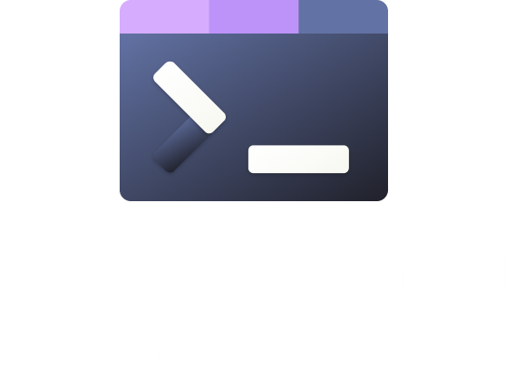

<h1 align="center"></h1>

<p align="center"> </p>

See your favorite colors of choice for your Windows Terminal.

## Table of Contents
- [Demonstration 📹](#demonstration)
- [Features 💡](#features)
- [Installation 📦](#installation)
- [Contributing 🛠](#contributing)
- [Contact 📧](#contact)
- [License ⚖](#license)

## Demonstration

Here is a demonstration video of how it's working:

<video controls>
    <source src="./docs/demonstration.mp4" />
</video>

## Features

### Custom Color Schemes

You can generate color themes **blazingly fast**! Because of use of WebAssembly and Algorithmic way of choosing colors, you will always get something beautiful in output.

### Preview Functionality

You can preview what the theme looks like.

### Easy to use

Through it's simple UI and and a perfect user experience, you will never get trouble because of it's full optimisation to content everyone.

### Export/Import Themes

You can import your own themes into the website to watch if the colors match other interesting patterns or to share them to others.

## Installation

1. To install Rust, follow the [official instructions](https://www.rust-lang.org/tools/install).
2. Clone the repository
    - using Git:
    ```bash
    git clone https://github.com/lelouchfr/windows-terminal-theme-generator.git
    ```
    - using ssh:
    ```bash
    git@github.com:LelouchFR/windows-terminal-theme-generator.git
    ```
    - using Github CLI:
    ```bash
    gh repo clone LelouchFR/windows-terminal-theme-generator
    ```
3. Run `cargo install --locked trunk` if trunk isn't installed.
4. Run `rustup target add wasm32-unknown-unknown` if WebAssembly target isnt installed.
5. Run `trunk serve` to build & serve the application to [localhost:5173](http://127.0.0.1:5173/).

## Contributing

We welcome contributions! Follow these steps to contribute:

1. Fork the repository
2. Make your changes
3. Add yourself to the contributions markdown file
4. Open a pull request

## Contact

For issues and feature requests, feel free to [open an issue](https://github.com/lelouchfr/windows-terminal-theme-generatorl/issues)

## License

This project is licensed under the **Apache License V2.0** - see the [LICENSE](LICENSE) file for details.
